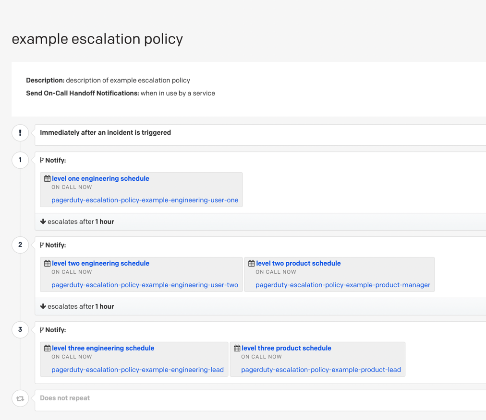

# PagerDuty Escalation Policy Example

This example creates a 3-level escalation policy - an example screenshot is provided below:

<!-- BEGIN_TF_DOCS -->
## Requirements

| Name | Version |
|------|---------|
|  [pagerduty](#requirement\_pagerduty) | >= 2.7 |

## Providers

No providers.

## Modules

| Name | Source | Version |
|------|--------|---------|
|  [engineering\_lead](#module\_engineering\_lead) | ../../modules/pagerduty-user | n/a |
|  [engineering\_user\_one](#module\_engineering\_user\_one) | ../../modules/pagerduty-user | n/a |
|  [engineering\_user\_two](#module\_engineering\_user\_two) | ../../modules/pagerduty-user | n/a |
|  [escalation\_policy](#module\_escalation\_policy) | ../../modules/pagerduty-escalation-policy | n/a |
|  [level\_one\_engineering\_schedule](#module\_level\_one\_engineering\_schedule) | ../../modules/pagerduty-schedule | n/a |
|  [level\_three\_engineering\_schedule](#module\_level\_three\_engineering\_schedule) | ../../modules/pagerduty-schedule | n/a |
|  [level\_three\_product\_schedule](#module\_level\_three\_product\_schedule) | ../../modules/pagerduty-schedule | n/a |
|  [level\_two\_engineering\_schedule](#module\_level\_two\_engineering\_schedule) | ../../modules/pagerduty-schedule | n/a |
|  [level\_two\_product\_schedule](#module\_level\_two\_product\_schedule) | ../../modules/pagerduty-schedule | n/a |
|  [mock\_team](#module\_mock\_team) | ../../modules/pagerduty-team | n/a |
|  [product\_lead](#module\_product\_lead) | ../../modules/pagerduty-user | n/a |
|  [product\_manager](#module\_product\_manager) | ../../modules/pagerduty-user | n/a |

## Resources

No resources.

## Inputs

| Name | Description | Type | Default | Required |
|------|-------------|------|---------|:--------:|
|  [description](#input\_description) | The description to set for the schedule. | `string` | `"example escalation policy description"` | no |
|  [escalation\_delay\_in\_minutes](#input\_escalation\_delay\_in\_minutes) | Minutes until an incident is escalated. | `number` | `60` | no |
|  [escalation\_levels](#input\_escalation\_levels) | Escalation levels and targets | `list` | `[]` | no |
|  [name](#input\_name) | The name to set for the schedule. | `string` | `"example escalation policy name"` | no |
|  [pagerduty\_token](#input\_pagerduty\_token) | PagerDuty API token. | `string` | n/a | yes |
|  [schedule\_suffix](#input\_schedule\_suffix) | Suffix to the schedule names | `string` | n/a | yes |

## Outputs

| Name | Description |
|------|-------------|
|  [id](#output\_id) | n/a |
<!-- END_TF_DOCS -->
